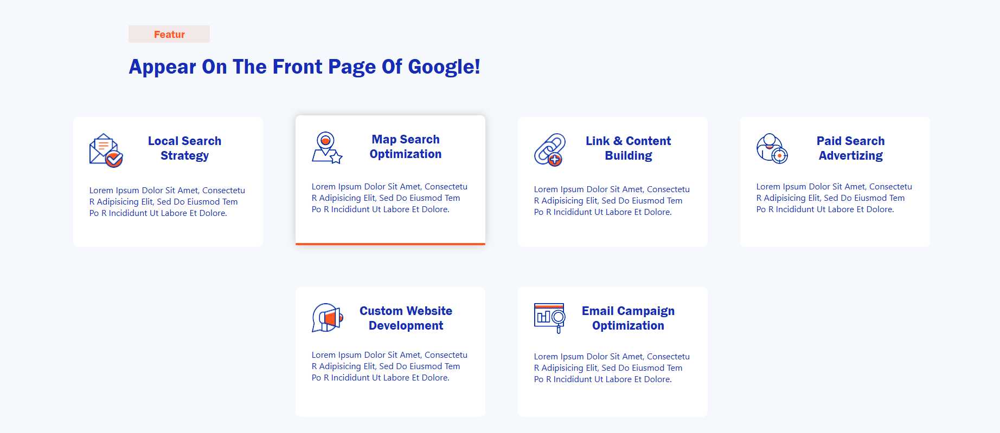
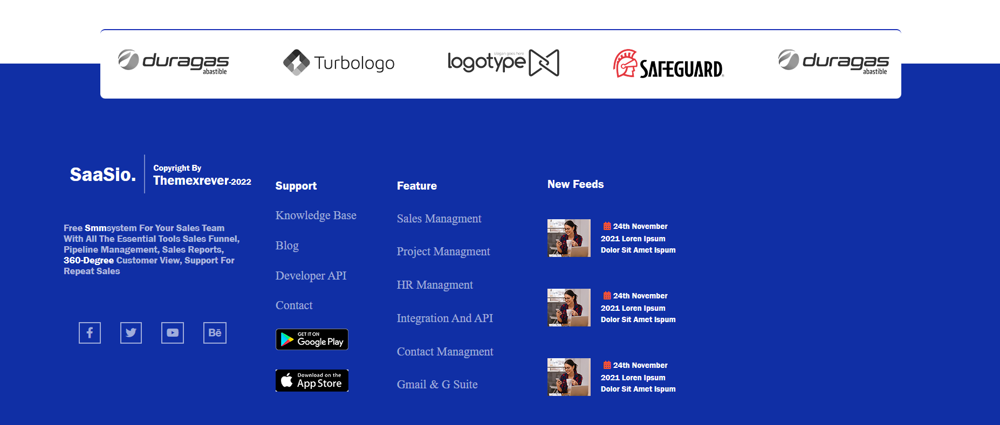

# SaaSio Clone

A simple clone of the SaaSio website using HTML and CSS.

## Table of Contents
- [Overview](#overview)
- [Demo](#demo)
- [Features](#features)
- [Installation](#installation)
- [Screenshots](#screenshots)
- [Contributing](#contributing)
- [License](#license)

## Overview
This project is a clone of the SaaSio website built using HTML and CSS. It aims to replicate the design and layout of the original site to practice front-end development skills.


## Demo
You can view a live demo of the project [https://html.themexriver.com/Saasio/index-10.1.html](#).

## Features
- Responsive design
- Modern and clean layout
- Fully functional navigation

## Installation
1. Clone the repository:
   ```sh
   git clone https://github.com/AhmedAboRaya/Saasio-1.git
   

## Screenshots
- Home

- About

- Feature

- Team

- Skill

- Portfolio

- News

- Footer

